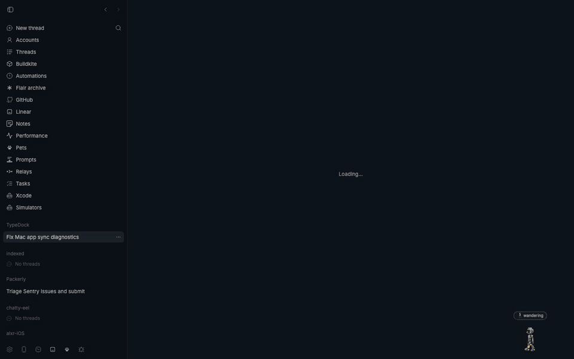
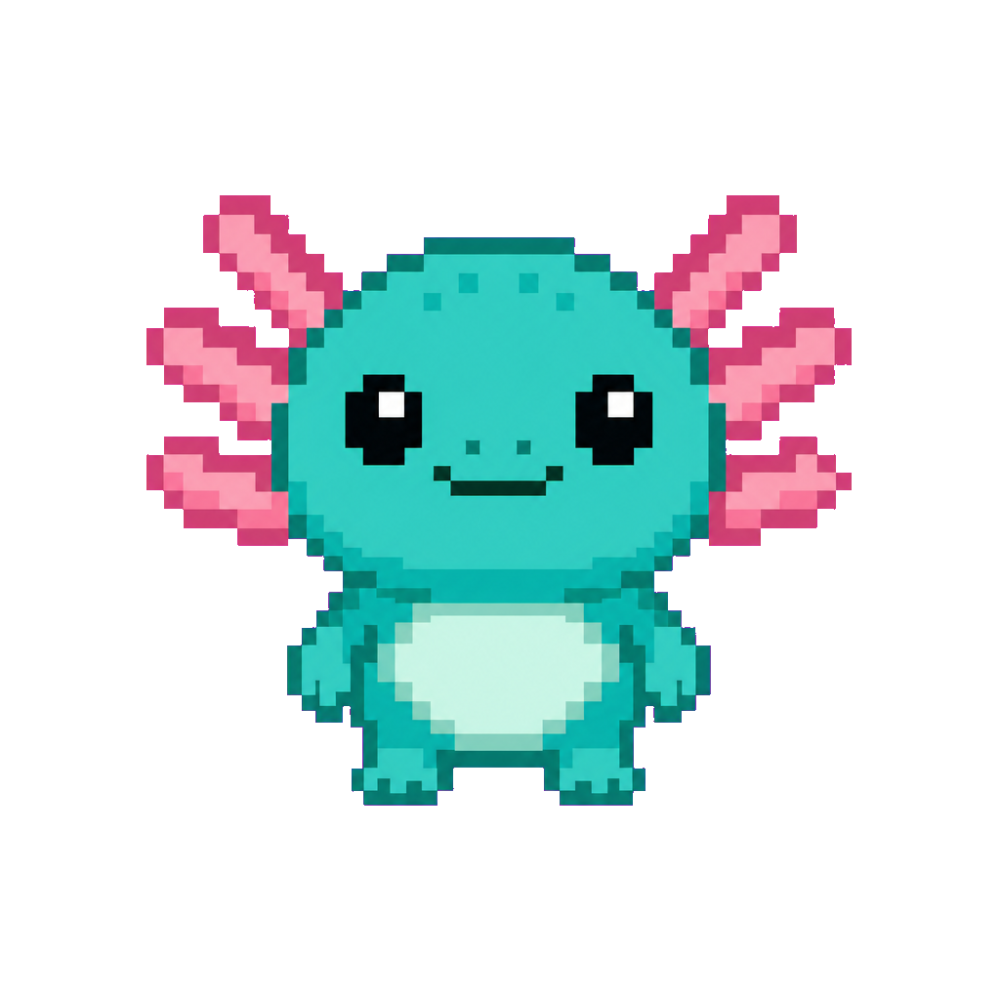
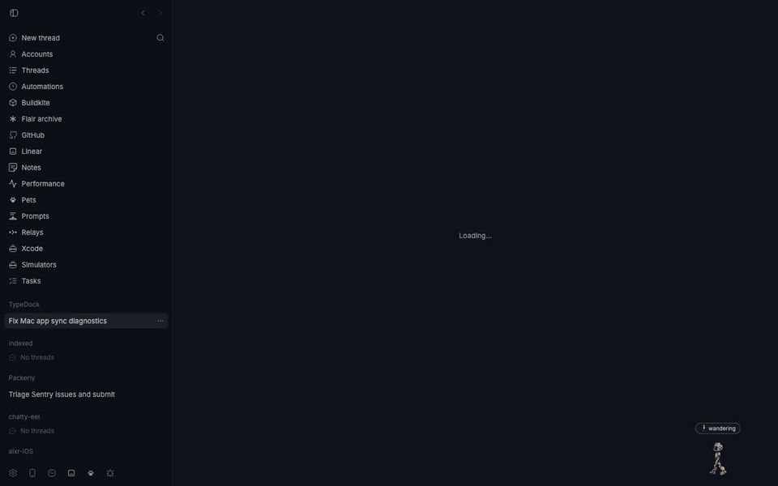
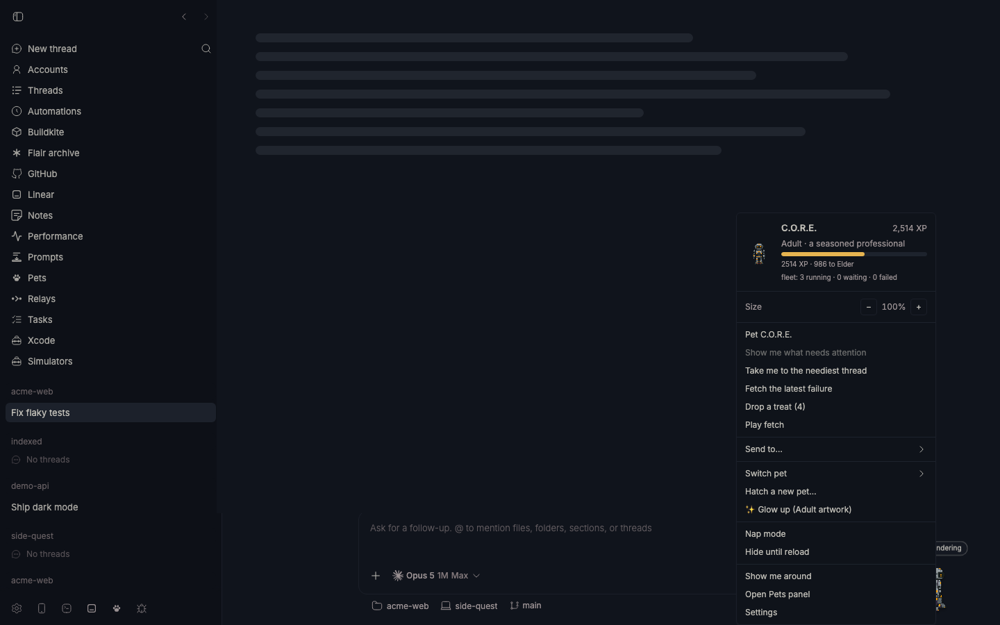
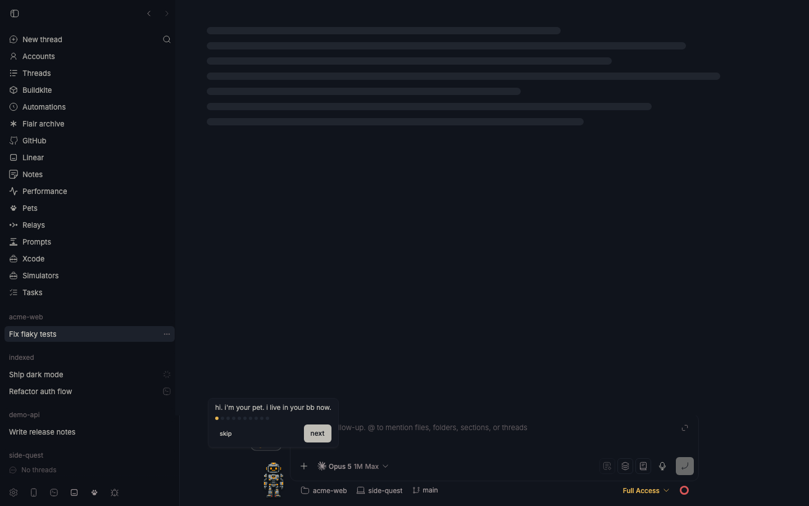
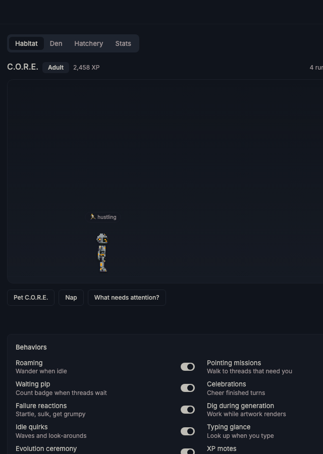
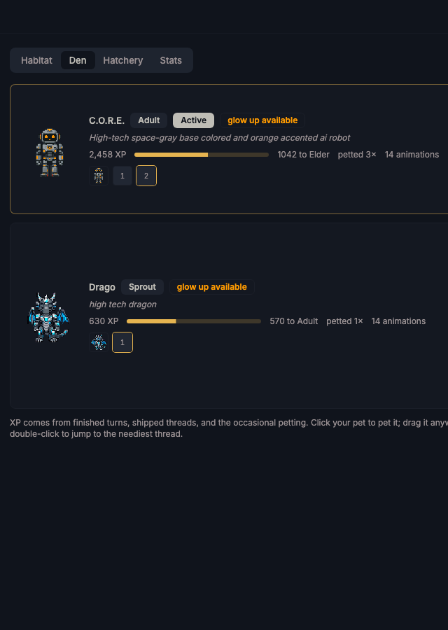
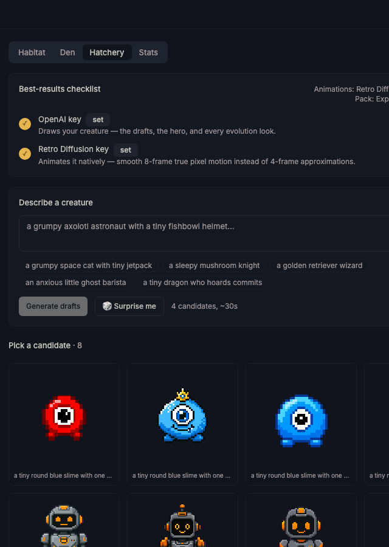
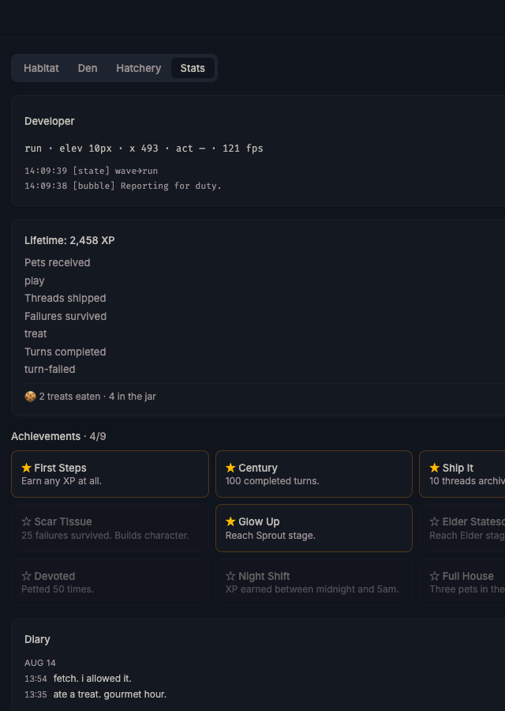

# bb-plugin-pets

An AI-hatched pixel companion that lives in your bb window, reacts to your
agents, and levels up from real work. Inspired by [Hermes pets](https://hermes-agent.nousresearch.com/docs/user-guide/features/pets),
rebuilt around what bb actually is: a fleet of agents.



*The composer is terrain, not an obstacle.*

## Install

```sh
bb plugin install git:https://github.com/vburojevic/bb-plugin-pets
```



It works the moment it lands — a bundled starter pet ships with the plugin, no
keys, no setup. Add an OpenAI API key (and optionally a Retro Diffusion key) in
the plugin's settings to hatch your own; the hatchery spells out what each key
unlocks.

Requires bb >= 0.37.

Keys can also be set from the CLI:
`bb plugin config pets set openaiApiKey sk-…`.

## What it does

- **A pixel creature roams the bottom of your bb window.** It mirrors your
  fleet: running agents → it thinks/hustles, a thread blocks on you → it
  taps its foot, a failure → it droops, everything quiet → it sleeps.
- **Pointing missions**: when a thread needs you, the pet walks to that
  thread's sidebar row, points at it, and pulses a highlight ring around it.
- **XP + evolution**: real work feeds it — finished turns (+10), shipped
  threads (+15), survived failures (+2), daily hello (+20), petting (+1).
  Stages: Hatchling → Sprout (300) → Adult (1200) → Elder (3500) → Mythic
  (8000). Positive-only; no hunger, no death, no nagging. Plugin-spawned and
  hidden threads earn nothing.
- **The hatchery**: describe a creature → 4 AI draft candidates → pick one →
  it becomes a fully animated pet (a gpt-image-2 hero portrait plus one
  animation strip per state in the configured pack). Evolutions can
  regenerate artwork per stage ("glow up"): leaf sprout → satchel → glasses
  and whiskers → crown.
- **Animation packs**: `essential` (9 states), `expanded` (14, the default),
  `deluxe` (18). The pack is a setting, and **Re-animate** in the Den
  upgrades an older pet to the current pack and engine in place.
  **Fix animations…** on a den card regenerates just the states you pick
  (walk-cycle quick-pick included) and merges them in.
- **It has a life of its own**: an autonomy director sends the pet off to
  wander, chase the cursor, dig at the sidebar, peek from an edge, watch the
  composer, take zoomies or a dance break, and drop context-aware one-liners
  built from your real fleet numbers. Five personality toggles (Funny,
  Chaotic, Sarcastic, Helpful, Cozy) plus an Activity level dial (calm →
  unhinged) live in the Personality card. Five minutes idle and it naps;
  come back and it wakes, stretches, and says hello.
- **Interactions**: click = pet · drag = move anywhere (drop high = perch,
  drop low = resume roaming, drop on a sidebar thread row = open that
  thread) · ⌥scroll = resize · double-click = jump to the neediest thread ·
  right-click = full menu.

  

  *Fetch: real physics, a run-boosted chase, and it always brings the ball back.*

- **Send it somewhere**: ⌘+click the desktop floor, tap the Habitat ground,
  or pick a named spot from the menu, and the pet walks there.

  

  *Right-click for the full menu: named spots, treats, the tour, everything.*

- **Emotion indicator**: an optional named-feeling badge above the pet
  (default off).
- **Ledge-walking**: the composer is terrain, not an obstacle — the pet hops
  up onto it and walks along its top edge (every visible composer, split
  panes included), but never loiters there, so naps, sits and digs always
  happen back on the floor. If it does end up over a focused input at floor
  level it fades to a click-through ghost as a safety net.
- **Per-pet sizing**: each pet carries its own scale (0.5×–2.5×) — ⌥scroll on
  the creature, or the −/+ stepper on its Den card. No global scale knob.
- **A tour that shows, not tells**: on first run the pet walks you through
  everything in 10 steps — a card follows it while it waves, demonstrates
  ⌘-click walking, hops the composer ledge, and explains missions, treats,
  fetch, personalities and the paw button. Esc skips; "Show me around" in the
  menu (or **Take the tour** in the Habitat) runs it again.

  

  *A card follows the pet while it demonstrates each step.*

- **Pets panel** in the sidebar: Habitat (the default tab, and the
  mobile-first home — the same canvas pet in a container instead of the
  window), Den (manage/rename/resize/switch), Hatchery, Stats (XP by source,
  achievements, activity).
- **Behavior toggles**: roaming, pointing missions, waiting pip,
  celebrations, failure reactions, dig-while-generating, idle quirks, typing
  glance, evolution ceremony, XP motes, sounds — switchable from the
  Behaviors card under the Habitat, and honored by both the overlay and the
  Habitat (along with walk speed and reduced motion).
- **The job system**: every generation (drafts, hatch, evolve, re-animate)
  runs server-side in a single job slot, so it survives navigation, reloads
  and closed windows. The JobBanner at the top of the panel reattaches to
  whatever is running — or to whatever failed while nobody was looking.
- `bb pets` CLI: `status` · `list` · `select` · `rename` · `on|off` ·
  `reset`.

### The panel

Four tabs in the sidebar — the pet's home, its paperwork, and its birthplace.

| Habitat | Den |
| --- | --- |
|  |  |
| **Hatchery** | **Stats** |
|  |  |

## Architecture notes

- The overlay is a **content script with its own React root** and a
  hook-free data plane: SDK app hooks require host slot context, so it uses
  plain `fetch` for rpc, its own WebSocket to `/ws` for realtime signals,
  and the Navigation API for route watching. `react-dom/client` is shimmed
  to the host, so rendering stays on the host's React.
- Sprites render on a **canvas** (integer source rects, smoothing off) —
  CSS background-position sprites bleed adjacent frames at fractional sizes.
- **Fleet state lives server-side** (lifecycle events + `thread:changed`
  interaction metadata, seeded from `threads.list`), so XP accrues and the
  CLI works with zero windows open.
- Generation (`src/spritegen.ts`): heroes/drafts via **gpt-image-2** with an
  automatic magenta chroma-key fallback (the model drops native transparency
  often enough that keying is the reliable path). Animation strips come from
  **Retro Diffusion**'s pixel-native animation API when an `rdpk-` key is set
  — 16-frame walk/idle loops, 8 frames elsewhere, native 64px — otherwise
  from gpt-image strips (one row of four; models miscount larger grids) with
  flood-deglow. How many strips get generated is the **animation pack**
  (`ANIMATION_PACKS` in `src/atlas.ts`: essential 9 / expanded 14 /
  deluxe 18); missing states fall back through `STATE_FALLBACKS`, so a pet on
  a smaller pack still plays everything. Everything gpt-made passes through
  `src/quantize.ts`: baseline alignment, nearest downscale to 64px cells,
  shared 24-color median-cut palette — true pixel art from any model.
- **Side-profile locomotion**: Retro Diffusion animates the hero exactly as
  posed, so a front-facing portrait produced a front-facing walk. Each pet
  caches a right-facing side-profile hero variant (one gpt-image edit,
  refreshed on evolution) that feeds the walk and run strips only;
  everything else still animates from the straight-on hero.

## Dev

```sh
npm install
bb plugin dev        # watch: rebuild app bundle + reload on save
npx tsc --noEmit     # typecheck
```

---

## More bb plugins

This is one of eight bb plugins I publish — see them all at
[**vburojevic/bb-plugins**](https://github.com/vburojevic/bb-plugins).
